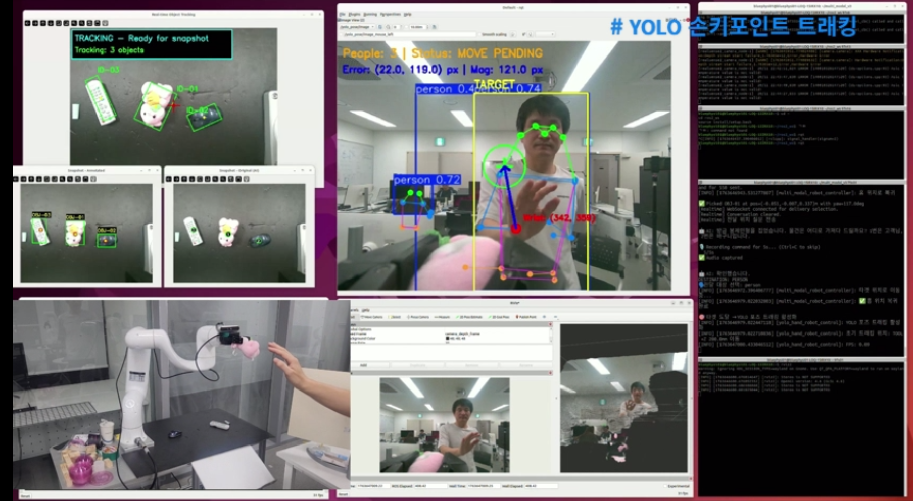

# 두산 E0509 멀티모달 픽업/핸드오버 시스템

Doosan E0509 협동로봇에 Realsense 3D 비전, OpenAI Realtime(음성/이미지), YOLO 포즈 트래킹을 결합한 데모입니다. 테이블 위 물체를 감지 → 음성으로 선택 → 집기 → 사람/바구니 전달 → (옵션) YOLO 포즈 기반 핸드오버까지 한 사이클로 수행합니다.

- **센서/AI**: Realsense RGB-D → 포인트클라우드 세그멘테이션(Open3D, HDBSCAN) → OBJ-XX 라벨링 → OpenAI Realtime 대화
- **로봇 제어**: DSR_ROBOT2 + DRL 그리퍼, 홈/타겟/바구니 좌표는 `config.py`에서 관리
- **핸드오버**: YOLO11n-pose 손목 추적 후 eye-in-hand servoing, 그리퍼 열고 복귀
- **GUI**: 실시간 트래킹 + 스냅샷(원본/어노테이션) 윈도우, 스냅샷은 `snapshots/`에 저장

## 폴더 구성
- `main.py`              : 전체 파이프라인 엔트리, 실행 옵션
- `robot_controller.py`  : ROS2 노드, Realsense 동기화, 물체 감지→집기/배치 시퀀스
- `vision_module.py`     : 포인트클라우드 기반 인스턴스 추출, 트래커/투영 유틸
- `object_mapper.py`     : OBJ-XX 라벨 부여, 스냅샷 생성/주석, PICK_LABEL 파싱
- `realtime_client.py`   : OpenAI Realtime 음성/이미지 대화, 스냅샷 승인·대상 선택·전달지 질문
- `yolo_hand_robot_control.py`: YOLO 포즈 servoing 노드(핸드오버)
- `config.py`            : 로봇/비전/YOLO/Realtime 파라미터 중앙 관리
- `system_prompt.py`     : 한국어 음성 비서용 시스템 프롬프트
- `snapshots/`           : 스냅샷 이미지 저장 디렉터리(자동 생성)

## 요구 사항
### 하드웨어
- Doosan E0509 + DSR 드라이버 동작
- 로봇 플랜지 장착 그리퍼(DSR DRL 제어)
- Intel RealSense RGB-D 카메라 (토픽: `/camera/camera/color/image_raw`, `/camera/camera/aligned_depth_to_color/image_raw`, `/camera/camera/aligned_depth_to_color/camera_info`)
- 마이크/스피커(음성 모드 사용 시)

### 소프트웨어
- ROS2 환경(dsr_ros2_pkg2 등으로 DSR_ROBOT2 정상 동작)
- RealSense ROS 드라이버가 위 토픽으로 퍼블리시 중일 것
- OpenAI Realtime 키: `.env` 또는 환경변수 `OPENAI_API_KEY` 설정
- YOLO 포즈 가중치 `yolo11n-pose.pt` 포함

### 사전 준비
1. ROS2 소스(`source /opt/ros/<distro>/setup.bash`) 후 Doosan bringup(예: `ros2 launch dsr_bringup2 dsr_bringup2.launch.py`)
2. RealSense 드라이버 실행, 카메라 토픽 확인
3. 오디오 입·출력 기본 장치 확인(필요 시 `sounddevice` 디바이스 번호 지정)
4. `config.py`에서 홈/타겟/바구니 관절값, 그리퍼 오프셋, YOLO 제어 파라미터를 현장에 맞게 조정

## 실행 방법
```bash
cd /home/<홈이름>/multi_modal_v3
python3 main.py [옵션]
```

자주 쓰는 옵션
- `--text-input-only`          : 마이크 없이 터미널 텍스트로 응답
- `--disable-multimodal`       : OpenAI Realtime 비활성화
- `--disable-yolo-pose`        : 핸드오버용 YOLO 포즈 비활성화
- `--skip-mic-test`            : 시작 시 마이크 테스트 생략
- `--play-audio-responses`     : AI 응답 오디오 재생
- `--realtime-model <name>`    : Realtime 모델 교체(기본: `gpt-realtime-mini`)
- `--operator-audio-seconds N` : 명령 녹음 길이(초) 조정

예) 마이크 없이 핸드오버 끄기:
```bash
python3 main.py --text-input-only --disable-yolo-pose
```

## 동작 흐름
1. 카메라 스트림 대기 → 실시간 트래킹 GUI 표시
2. AI가 “스냅샷을 찍을까요?” 질문 → 승낙 시 최신 프레임 스냅샷 생성, `snapshots/`에 저장
3. OBJ-XX 라벨 이미지와 요약을 Realtime API로 전송 → 음성/텍스트로 집을 물체 결정(PICK_LABEL)
4. 로봇 시퀀스: 그리퍼 개방 → 목표 접근(오프셋 적용) → 회전 정렬 → 그리퍼 폐합 → 홈 복귀
5. 전달지 질문: `person`이면 타겟 자세 이동 후 (옵션) YOLO 포즈 핸드오버, `basket`이면 바구니 자세 이동 후 내려놓고 홈 복귀
6. 다음 사이클로 복귀

## 작동 영상

[](https://cdn.jsdelivr.net/gh/bluephysi01/Multi_Modal_Doosan_Robot_System@main/assets/robot_demo.mp4)
